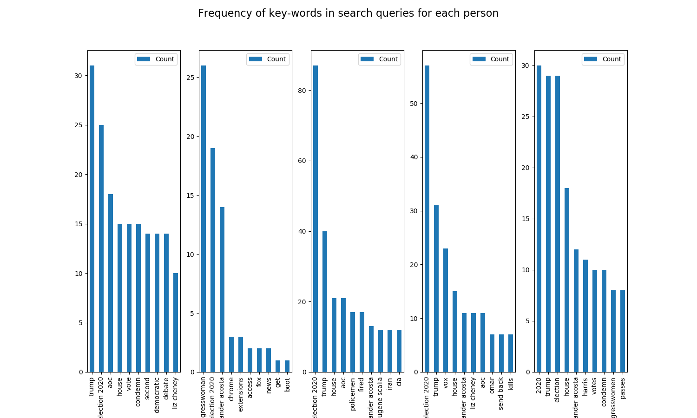
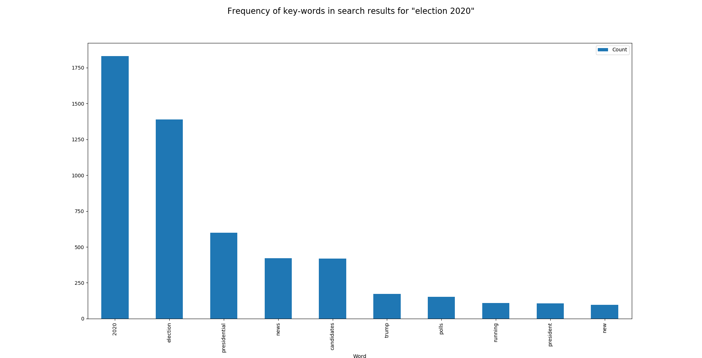

# Data visualization of search history

This program visualizes search history data stored in .json files. The main features of this program are:
* Find the k-most used terms in search-queries of all the users.
* Find the similarity of search terms among users.
* Find the k-most common terms in search results of users based on a search query word/phrase.
* View raw json data of person(s).
* View the search queries of person(s).
 

## Pre-requisites

Python 3.7\
Pandas\
numpy

## Json format
The data is in the following format:
* userID (string): A random id assigned to each user
* searchData (list/array): A list of json objects, where each object represents a page of google search results
  * searchQueryPageNum (float): The page number from google search 
  * searchQueryString (string): The query entered into google search
  * hostname (string): The host url, it should be google.com, feel free to ignore
  * timestamp (string): UTC formatted timestamp string of when the search was done
  * searchResults (list/array): A list of json objects, where each objects contains a single news article from the search page
    * title (string): The title of the news article
    * url (string): The url of the news article

Note: The timestamp field is missing in some of the files.

The .json files are stored in `\data\`.

Additionally, `\data\queries\` has a query file for each of the original files. These store just queries for the particular person for easier processing of data.

The folder also has `key_phrases.txt` which stores certain key words which tells the program to group certain words together, rather than as separate entities. For example, 'liz cheney' might make better sense than 'liz' and 'cheney.'

## Usage
The program can be run by simply executing the `main.py` from the `src\` folder like this:
```python
python main.py
```
Following which, the name of the various data files containing the search histories will be shown along with a menu which will have various options to explore the data. This is the output when the above command is run:
```console
There are 5 files with the search history of 5 people. They are

p1
p2
p3
p4
p5


Choose an option
1) Display raw json data of person(s).
2) Display all search query results of person(s)
3) Display k-most used terms in search queries of users.
4) Display similarity of search terms in user queries.
5) Display k-most common term in search-results of users based on a search-query word/phrase.
6) Exit
Enter choice number:
```

One can choose any of the options to view particular trends in the search history data.

For example, the following is the output when the user enters 4.

```console
Enter choice number: 4
Enter the names of people whose search history is to be compared(Atleast 2).
Enter names separated by comma: p3,p4,p5
The search-query terms in common for the above users are:

passes
votes
acosta
wage
booker
election
scalia
liz
cheney
house
congresswoman
harris
2020
condemn
eugene
biden
aoc
trump
bill
alexander
minimum
----------------------Press any key and <enter> to continue----------------------
----------------------Press q and <enter> to exit----------------------
```
Note that `p3,p4,p5` in the third line is entered by the user.

If the user enters option 3, the following is the output:
```console
Enter choice number: 3
Enter k: 10
```
`k` is entered by the user which indicates that the top 10 common search-query terms are shown. The following figure is also shown. Close the matplotlib window to continue.



The rest of the options work in a similar way too.

Option 5 takes a word/phrase from the user and show the top `k` terms in search results whose queries have the word/phrase. This shows the relationship between the search-query and search-result.

The following is the visualization for option 5. It shows the 10 most appearing terms in search results when the search query of the user contained the term 'election 2020'.



## References
The .json files are provided by Nobias and the format information is taken from the following site.

[Nobias data visualizaton](https://www.notion.so/Nobias-Data-Visualization-Project-4643ed5a100d47099ec5f20b992fd68a)


